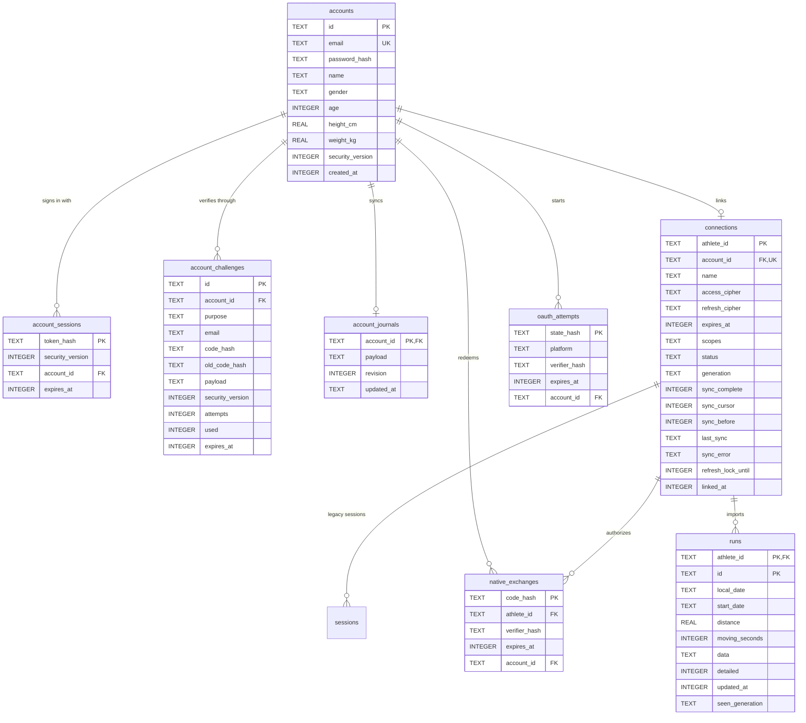

# Growth database architecture

Growth uses one Cloudflare D1 database. D1 is SQLite-compatible, and the schema is defined entirely by the ordered SQL files in [`server/migrations`](../server/migrations). This document describes the schema after migration `0005_account_strava.sql`.

## Relationship chart

`events`, `food_cache`, and `rate_buckets` are operational tables without foreign-key relationships, so they are documented below rather than included in the relationship chart.

## Table reference

| Table                | Ownership and purpose                                                                                                                                                                                          | Retention and deletion                                                                                                                             |
| -------------------- | -------------------------------------------------------------------------------------------------------------------------------------------------------------------------------------------------------------- | -------------------------------------------------------------------------------------------------------------------------------------------------- |
| `accounts`           | Canonical Growth identity, normalized body measurements, password hash, and security version. Email is unique without regard to case.                                                                          | The parent record for account-owned cloud data. Deleting it cascades to sessions, challenges, the synchronized journal, and the Strava connection. |
| `account_sessions`   | Hashed browser or native login tokens. The recorded security version invalidates older sessions after sensitive account changes.                                                                               | Expires automatically and cascades when its account is deleted.                                                                                    |
| `account_challenges` | Registration, email-change, and password-reset challenges. Codes are hashed; `payload` carries purpose-specific JSON.                                                                                          | Short-lived, attempt-limited, and cascades for an existing account. Registration challenges may temporarily have no account.                       |
| `account_journals`   | One versioned JSON journal per account. It is the cross-device snapshot for meals, saved foods, weights, lifts, goals, appearance, and preferences.                                                            | Revision checking prevents stale writes. Deleting the account deletes the journal.                                                                 |
| `connections`        | One encrypted Strava OAuth connection per Growth account. `athlete_id` identifies provider data; a partial unique index on `account_id` enforces at most one Strava account per Growth account.                | Manual disconnect or Strava deauthorization deletes the connection and its cached runs. Account deletion also cascades here.                       |
| `oauth_attempts`     | Short-lived, single-use OAuth state bound to the Growth account that initiated the connection.                                                                                                                 | Deleted when consumed or expired.                                                                                                                  |
| `native_exchanges`   | Short-lived, single-use native OAuth result bound to both the Growth account and initiating device verifier.                                                                                                   | Cascades with the account or Strava connection and is deleted when consumed or expired.                                                            |
| `runs`               | Cached Strava run records. The composite primary key `(athlete_id, id)` keeps provider IDs isolated per athlete. Search columns are stored separately; the complete normalized run is retained in `data` JSON. | Cascades when the Strava connection is removed. It is provider-derived data and can be rebuilt by syncing Strava.                                  |
| `sessions`           | Legacy Strava-only session records retained for schema compatibility. Current clients use `account_sessions`.                                                                                                  | Cascades with the Strava connection. Safe to remove in a later dedicated cleanup migration after confirming no old client depends on it.           |
| `events`             | Deduplication and processing state for Strava webhook deliveries.                                                                                                                                              | Processed records are periodically removed. It intentionally has no foreign key because webhook delivery can precede or outlive a connection.      |
| `food_cache`         | Expiring cache of Open Food Facts search and food-detail responses.                                                                                                                                            | Disposable and periodically expired. It contains no account-owned journal entries.                                                                 |
| `rate_buckets`       | Per-minute counters used to protect API endpoints.                                                                                                                                                             | Disposable and periodically expired.                                                                                                               |

## Storage boundaries

The device database remains the working copy of the journal. When signed in, `account_journals.payload` is the cloud synchronization record. Strava runs are stored in normalized server rows because they are queried by date and refreshed independently. Open Food Facts results are cached, while logged foods are copied into the journal as snapshots so later provider changes do not rewrite history.

Secrets are not stored in the database. Cloudflare Worker secrets hold provider credentials and encryption keys. Per-user Strava access and refresh tokens are stored only as encrypted ciphertext in `connections`; account passwords, login tokens, and verification codes are stored as hashes.

## Migration policy

1. Add every production schema change as the next numbered file in `server/migrations`. Never edit a migration after it has reached production.
2. Prefer additive changes: add nullable columns or new tables, deploy code that can handle both representations, backfill, then enforce stricter constraints in a later migration.
3. Test every migration against a fresh database and a database containing the previous schema before applying it remotely.
4. Back up or export production data before destructive migrations, large backfills, or changes that rebuild tables.
5. Keep provider-derived caches disposable. Account identity, journal data, and user-entered history require an explicit migration and verification plan.
6. Add indexes for demonstrated query patterns. Avoid duplicating every JSON field into a column until the server needs to query that field.
7. During a major data-model change, use a staged rollout: introduce the new tables, dual-write or backfill, verify counts and ownership, switch reads, and remove the old representation only after supported clients no longer require it.

## Planned expansion path

The versioned journal document is appropriate for whole-journal device synchronization and allows the existing local-first app to evolve without a server migration for every UI field. If Growth later needs server-side reporting, coaching, sharing, or high-volume queries across journal records, normalize only the required collections into account-owned tables such as:

- `weight_entries`
- `meals` and `food_entries`
- `workouts`, `exercises`, and `exercise_sets`
- `goals`
- `account_preferences`

These tables should use Growth-owned IDs rather than array positions or display names. Keep `account_journals` during the transition as a compatibility snapshot, backfill normalized rows with stable IDs, and record the new schema version in the journal payload. This supports an incremental migration to normalized D1 tables or a future relational database without an all-at-once client cutover.

## Recovery and portability

The schema uses standard SQL types, explicit foreign keys, and JSON stored as text. A future move to another relational database can preserve account IDs and relationships, copy journal payloads unchanged, and transform SQLite-specific DDL during import. Provider tokens must remain encrypted during any export and be re-encrypted if the destination uses a different key-management system.

The migration files are the authoritative schema history. This document is an architectural reference and must be updated whenever a migration changes ownership, constraints, or retention behavior.
